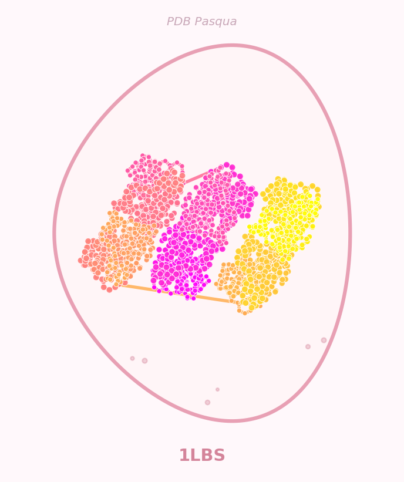
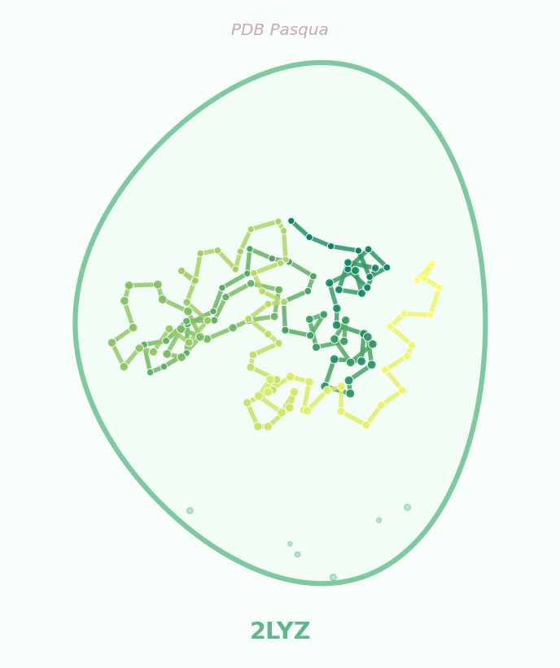

# PDB Easter Egg Decorator (PDB Pasqua)

A small [Streamlit](https://streamlit.io/) app that turns [RCSB PDB](https://www.rcsb.org/) structures into pastel Easter Egg PNGs from Cα traces (2D PCA projection).

<p align="center">
  
  &nbsp;&nbsp;
  
</p>

<p align="center"><em>Examples: <strong>1LBS</strong> and <strong>2LYZ</strong></em></p>

---

## Try it online

### Streamlit Community Cloud (recommended)

1. Open **[Streamlit Community Cloud](https://share.streamlit.io/)** and sign in with GitHub.
2. Click **Create app** → **Yup, I have an app.**
3. Either paste this entrypoint link: **`https://github.com/ganttmeredith/PDB-Easter-Egg-Decorator/blob/main/app.py`**, or choose repository **`ganttmeredith/PDB-Easter-Egg-Decorator`**, branch **`main`**, and main file **`app.py`**.

After the first deploy, you get a public **`*.streamlit.app`** URL to share. See [Deploy your app](https://docs.streamlit.io/deploy/streamlit-community-cloud/deploy-your-app/deploy) in the Streamlit docs.

[](https://share.streamlit.io/)

### GitHub Codespaces

Open the repo in a browser tab and use **Code → Codespaces → Create codespace on main**. When the container is ready, in the terminal run:

```bash
streamlit run app.py --server.address 0.0.0.0 --server.port 8501
```

Click **Open in browser** when VS Code prompts for port **8501**.

[](https://codespaces.new/ganttmeredith/PDB-Easter-Egg-Decorator?quickstart=1)

---

## Local setup

```bash
python3 -m venv .venv
source .venv/bin/activate   # Windows: .venv\Scripts\activate
pip install -r requirements.txt
```

## Run locally

```bash
streamlit run app.py
```

Enter up to three, four-character PDB IDs, click **Hatch my eggs!**, then download each PNG.

## License

Developed by Gantt Meredith, Orator (2026)

Structure data: [RCSB PDB](https://www.rcsb.org/).
